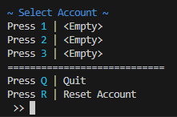
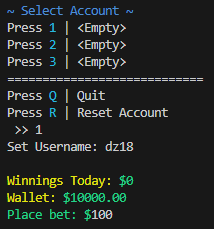
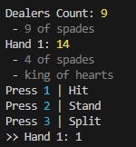
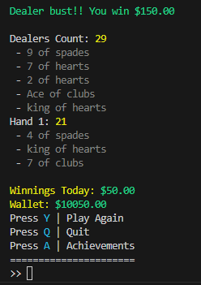

# Blackjack Game

Blackjack made using python where you play simulated games against the computer.

## Features

- Standard Blackjack rules
- 3/2 payout 
- 3 save states
- Achievements
- Terminal Version
- GUI Version (Coming soon!)

## Terminal Version

### Running the game

1. Run the file playTerminal.py

2. User is prompted with selecting an account with the corresponding number. User is also given the choice of ending the program.

3. If user selects an empty account, they will be enter a username.

4. Place a desired bet (Ex. $100) and game begins.

5. User is given the option 'hit' to draw another card, 'stand' to end your turn, and 'split' to split current hand into two hands with equal bets. 

6. Play the game of BlackJack

